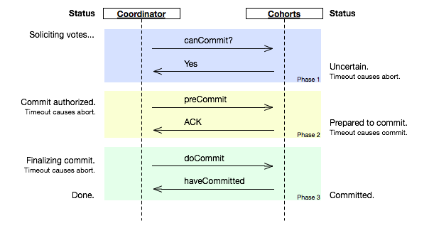

# 3PC

三阶段提交协议在协调者和参与者中都引入超时机制，并且把两阶段提交协议的第一个阶段分成了两步: 询问，然后再锁资源，最后真正提交。

## 三阶段的执行

1.**canCommit阶段**

3PC的canCommit阶段其实和2PC的准备阶段很像。协调者向参与者发送canCommit请求，参与者如果可以提交就返回yes响应，否则返回no响应。

2.**preCommit阶段**

协调者根据参与者canCommit阶段的响应来决定是否可以继续事务的preCommit操作。根据响应情况，有下面两种可能:

a\) 协调者从所有参与者得到的反馈都是yes:

那么进行事务的预执行，协调者向所有参与者发送preCommit请求，并进入prepared阶段。参与者和接收到preCommit请求后会执行事务操作，并将undo和redo信息记录到事务日志中。如果一个参与者成功地执行了事务操作，则返回ACK响应，同时开始等待最终指令

b\) 协调者从所有参与者得到的反馈有一个是No或是等待超时之后协调者都没收到响应:

那么就要中断事务，协调者向所有的参与者发送abort请求。参与者在收到来自协调者的abort请求，或超时后仍未收到协调者请求，执行事务中断。

3.**doCommit阶段**

协调者根据参与者preCommit阶段的响应来决定是否可以继续事务的doCommit操作。根据响应情况，有下面两种可能:

a\) 协调者从参与者得到了ACK的反馈:

协调者接收到参与者发送的ACK响应，那么它将从预提交状态进入到提交状态，并向所有参与者发送doCommit请求。参与者接收到doCommit请求后，执行正式的事务提交，并在完成事务提交之后释放所有事务资源，并向协调者发送haveCommitted的ACK响应。那么协调者收到这个ACK响应之后，完成任务。

b\) 协调者从参与者没有得到ACK的反馈, 也可能是接收者发送的不是ACK响应，也可能是响应超时:

执行事务中断。

## reference

* [https://www.cnblogs.com/balfish/p/8658691.html](https://www.cnblogs.com/balfish/p/8658691.html)

