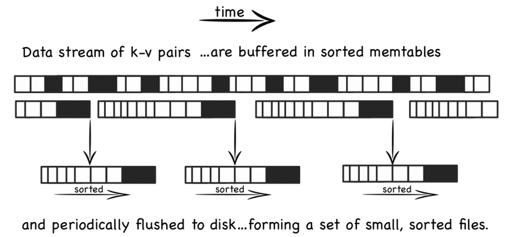

# LSM

LSM Tree\(Log Structured Merge Trees\)数据组织方式被应用于多种数据库，如LevelDB、HBase、Cassandra等，下面我们从为什么使用LSM tree、LSM tree的实现思路两方面介绍这种存储组织结构，完成对LSM tree的初步了解。

为优化日志型数据库的读性能，实际应用中通常结合以下几种优化措施：

* **二分查找\(Binary Search\)**: 在一个数据文件中使用二分查找加速数据查找
* **哈希\(Hash\)**: 写入时通过哈希函数将数据放入不同的桶中，读取时通过哈希索引直接读取
* **B+树**: 使用B+树作为数据组织存储形式，保持数据稳定有序
* **外部索引文件**: 除数据本身按日志形式存储外，另对其单独建立索引加速读取

## **LSM Tree存储结构**

LSM tree存储实现思路与以上四种措施不太相同，其将随机写转化为顺序写，尽量保持日志型数据库的写性能优势，并提供相对较好的读性能。具体实现方式如下：

1. 当有写操作\(或update操作\)时，写入位于内存的buffer，内存中通过某种数据结构\(如skiplist\)保持key有序
2. 一般的实现也会将数据追加写到磁盘Log文件，以备必要时恢复
3. 内存中的数据定时或按固定大小地刷到磁盘，更新操作只不断地写到内存，并不更新磁盘上已有文件
4. 随着越来越多写操作，磁盘上积累的文件也越来越多，这些文件不可写且有序
5. 定时对文件进行合并操作\(compaction\)，消除冗余数据，减少文件数量

LSM Tree存储结构的写操作，只需更新内存，内存中的数据以块数据形式刷到磁盘，是顺序的IO操作，另外磁盘文件定期的合并操作，也将带来磁盘IO操作。

LSM tree存储结构的读操作，先从内存数据开始访问，如果在内存中访问不到，再顺序从一个个磁盘文件中查找，由于文件本身有序，并且定期的合并减少了磁盘文件个数，因而查找过程相对较快速。

## 总结

LSM tree存储框架实现的思路较简单，其先在内存中保存数据，再定时刷到磁盘，实现顺序IO操作，通过定期合并文件减少数据冗余；文件有序，保证读取操作相对快速。

我们需要结合实际的业务场景选择合适的存储实现，不存在万金油式的通用存储框架。LSM tree适用于写多、读相对少\(或较多读取最新写入的数据，该部分数据存在内存中，不需要磁盘IO操作\)的业务场景。

## reference

* [http://www.cnblogs.com/bangerlee/p/4307055.html](http://www.cnblogs.com/bangerlee/p/4307055.html)

