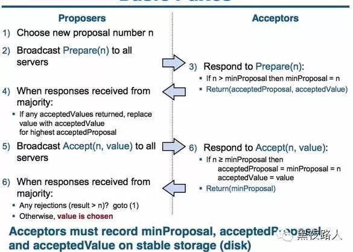
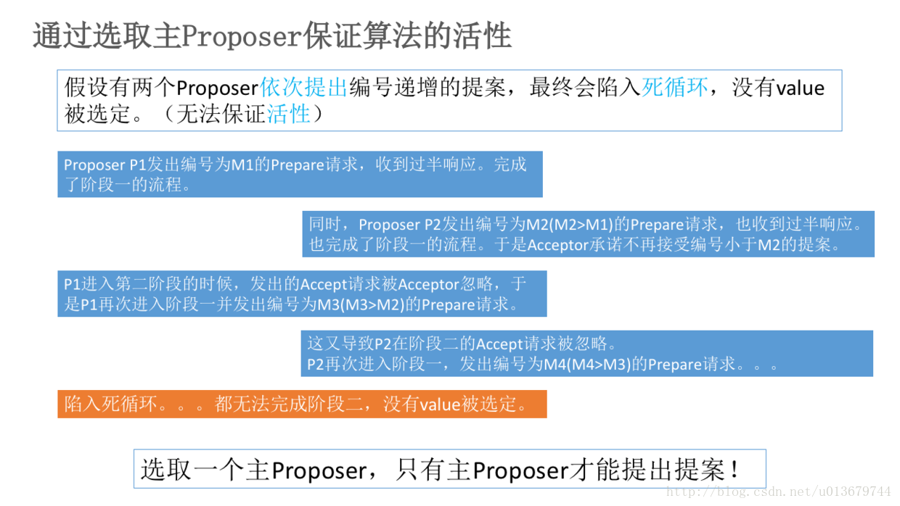

# Paxos

## **背景**

Paxos: 发音 帕克索斯 [https://zh.forvo.com/word/paxos/](https://zh.forvo.com/word/paxos/)

Paxos算法是Lamport于1990年提出的一种基于消息传递的一致性算法。由于算法难以理解起初并没有引起人们的重视，使Lamport在八年后重新发表到TOCS上。即便如此paxos算法还是没有得到重视，2001年Lamport用可读性比较强的叙述性语言给出算法描述。可见Lamport对paxos算法情有独钟。近几年paxos算法的普遍使用也证明它在分布式一致性算法中的重要地位。06年google的三篇论文初现“云”的端倪，其中的chubby锁服务使用paxos作为chubby cell中的一致性算法，paxos的人气从此一路狂飙。

## Paxos算法是什么

Paxos 算法解决的问题是一个分布式系统如何就某个值（决议）达成一致。一个典型的场景是，在一个分布式数据库系统中，如果各节点的初始状态一致，每个节点都执行相同的操作序列，那么他们最后能得到一个一致的状态。为保证每个节点执行相同的命令序列，需要在每一条指令上执行一个“一致性算法”以保证每个节点看到的指令一致，是分布式计算中的重要问题。

## Paxos的两个原则

### 安全原则---保证不能做错的事

1.只能有一个值被批准，不能出现第二个值把第一个覆盖的情况。

2.每个节点只能学习到已经被批准的值，不能学习没有被批准的值。

### 存活原则---只要有多数服务器存活并且彼此间可以通信最终都要做到的事

1.最终会批准某个被提议的值。

2.一个值被批准了，其他服务器最终会学习到这个值。这个原则能够保证的话就没有了活锁的问题。

## Paxos的三个角色

在具体的实现中，一个进程可能同时充当多种角色。比如一个进程可能既是Proposer又是Acceptor又是Learner。

* Proposer负责提出提案。
* Acceptor负责对提案作出裁决（accept与否）。
* learner负责学习提案结果。

还有一个很重要的概念叫提案（Proposal）。最终要达成一致的value就在提案里。只要Proposer发的提案被Acceptor接受（半数以上的Acceptor同意才行），Proposer就认为该提案里的value被选定了。Acceptor告诉Learner哪个value被选定，Learner就认为那个value被选定。只要Acceptor接受了某个提案，Acceptor就任务该提案里的value被选定了。

为了避免单点故障，会有一个Acceptor集合，Proposer向Acceptor集合发送提案，Acceptor集合中的每个成员都有可能同意该提案且每个Acceptor只能批准一个提案，只有当一半以上的成员同意了一个提案，就认为该提案被选定了。

## Paxos算法过程

Paxos算法类似于两阶段提提交，其算法执行过程分为两个阶段。具体如下：

阶段一（prepare阶段）：

1. Proposer选择一个提案编号N，然后向半数以上的Acceptor发送编号为N的Prepare请求。Pareper（N）
2. 如果一个Acceptor收到一个编号为N的Prepare请求，如果小于它已经响应过的请求，则拒绝，不回应或回复error。若N大于该Acceptor已经响应过的所有Prepare请求的编号（maxN），那么它就会将它已经接受过（已经经过第二阶段accept的提案）的编号最大的提案（如果有的话，如果还没有的accept提案的话返回{pok，null，null}）作为响应反馈给Proposer，同时该Acceptor承诺不再接受任何编号小于N的提案。

阶段二（accept阶段）：

1. 如果一个Proposer收到半数以上Acceptor对其发出的编号为N的Prepare请求的响应，那么它就会发送一个针对\[N,V\]提案的Accept请求给半数以上的Acceptor。注意：V就是收到的响应中编号最大的提案的value（某个acceptor响应的它已经通过的{acceptN，acceptV}），如果响应中不包含任何提案，那么V就由Proposer自己决定。
2. 如果Acceptor收到一个针对编号为N的提案的Accept请求，只要该Acceptor没有对编号大于N的Prepare请求做出过响应，它就接受该提案。如果N小于Acceptor以及响应的prepare请求，则拒绝，不回应或回复error（当proposer没有收到过半的回应，那么他会重新进入第一阶段，递增提案号，重新提出prepare请求）。

### Paxos 算法实例

prepare阶段

* 每个server向proposer发送消息，表示自己要当leader，假设proposer收到消息的时间不一样，顺序是： proposer2 -&gt; proposer1 -&gt; proposer3，消息编号依次为1、2、3。 
* 紧接着，proposer将消息发给acceptor中超过半数的子成员\(这里选择两个\)，proposer2向acceptor2和acceptor3发送编号为1的消息，proposer1向acceptor1和accepto2发送编号为2的消息，proposer3向acceptor2和acceptor3发送编号为3的消息。 
* 假设这时proposer1发送的消息先到达acceptor1和acceptor2，它们都没有接收过请求，所以接收该请求并返回【pok，null，null】给proposer1，同时acceptor1和acceptor2承诺不再接受编号小于2的请求； 
* 紧接着，proposer2的消息到达acceptor2和acceptor3，acceptor3没有接受过请求，所以返回proposer2 【pok，null，null】，acceptor3并承诺不再接受编号小于1的消息。而acceptor2已经接受proposer1的请求并承诺不再接收编号小于2的请求，所以acceptor2拒绝proposer2的请求； 
* 最后，proposer3的消息到达acceptor2和acceptor3，它们都接受过提议，但编号3的消息大于acceptor2已接受的2和acceptor3已接受的1，所以他们都接受该提议，并返回proposer3 【pok，null，null】； 
* 此时，proposer2没有收到过半的回复，所以重新取得编号4，并发送给acceptor2和acceptor3，此时编号4大于它们已接受的提案编号3，所以接受该提案，并返回proposer2 【pok，null，null】。

accept阶段

* Proposer3收到半数以上（两个）的回复，并且返回的value为null，所以，proposer3提交了【3，server3】的提案。 
* Proposer1也收到过半回复，返回的value为null，所以proposer1提交了【2，server1】的提案。 
* Proposer2也收到过半回复，返回的value为null，所以proposer2提交了【4，server2】的提案。 
* （这里要注意，并不是所有的proposer都达到过半了才进行第二阶段，这里只是一种特殊情况）
* Acceptor1和acceptor2接收到proposer1的提案【2，server1】，acceptor1通过该请求，acceptor2承诺不再接受编号小于4的提案，所以拒绝；
* Acceptor2和acceptor3接收到proposer2的提案【4，server2】，都通过该提案；
* Acceptor2和acceptor3接收到proposer3的提案【3，server3】，它们都承诺不再接受编号小于4的提案，所以都拒绝。

所以proposer1和proposer3会再次进入第一阶段，但这时候 Acceptor2和acceptor3已经通过了提案（AcceptN = 4，AcceptV=server2），并达成了多数，所以proposer会递增提案编号，并最终改变其值为server2。最后所有的proposer都肯定会达成一致，这就迅速的达成了一致。

此时，过半的acceptor（acceptor2和acceptor3）都接受了提案【4，server2】，learner感知到提案的通过，learner开始学习提案，所以server2成为最终的leader。

## Learner学习被选定的value（第二阶段accept的）

## 

## Paxos算法的活锁问题（保证算法活性）

上边我们介绍了Paxos的算法逻辑，但在算法运行过程中，可能还会存在一种极端情况，当有两个proposer依次提出一系列编号递增的议案，那么会陷入死循环，无法完成第二阶段，也就是无法选定一个提案。如下图：

通过选取主Proposer，就可以保证Paxos算法的活性。选择一个主Proposer，并规定只有主Proposer才能提出议案。这样一来，只要主Proposer和过半的Acceptor能够正常进行网络通信，那么肯定会有一个提案被批准（第二阶段的accept），则可以解决死循环导致的活锁问题。

## reference

* [http://chuansong.me/n/1050231](http://chuansong.me/n/1050231)
* [https://medium.com/coinmonks/paxos-made-simple-3b83c05aac37](https://medium.com/coinmonks/paxos-made-simple-3b83c05aac37)
* [https://blog.csdn.net/u013679744/article/details/79222103 ](https://blog.csdn.net/u013679744/article/details/79222103)

