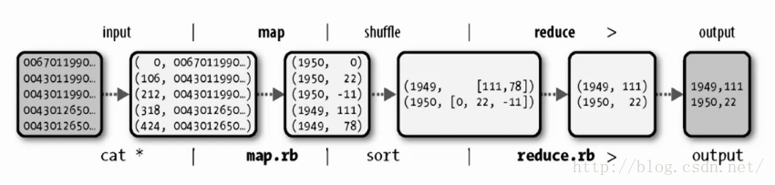
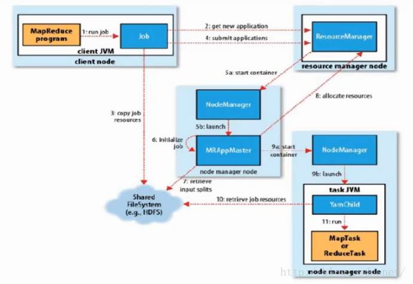
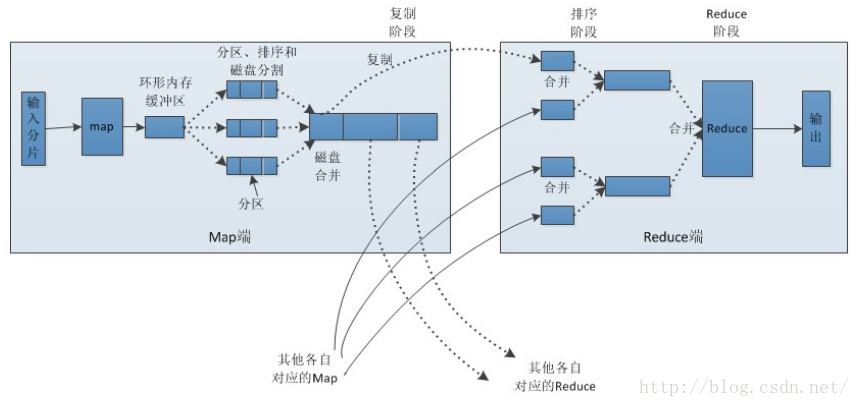

# MapReduce

MapReduce是由Google公司研究提出的一种面向大规模数据处理的并行计算模型和方法，是Hadoop面向大数据并行处理的计算模型、框架和平台。

## MapReduce执行流包括input、map、shuffle、reduce和output共5个过程，如下图所示： MapReduce2运行原理

YARN框架下的Mapreduce工作流程如下图所示：

步骤1：客户端向集群提交作业。

步骤2：Job从ResourceManager获取新的作业应用程序ID。

步骤3：客户端检查作业的输出情况，计算输入分片，并将作业jar包、配置、分片信息等作业资源复制到HDFS。

步骤4：Job向ResourceManager提交作业。

步骤5：ResourceManager接收到作业后，将作业请求传递给调度器，调度器根据作业信息为ResourceManager分配一个container，然后ResourceManager在NodeManager的管理下，在container中启动一个ApplicationMaster进程。

步骤6：ApplicationMaster对作业进行初始化，并保持对作业的跟踪，判断作业是否完成。

步骤7：ApplicationMaster根据存储在HDFS中的分片信息确定Map和Reduce的数量。

步骤8：ApplicationMaster为本次作业的Map和Reduce以轮询的方式向ResourceManager申请container。

步骤9：ApplicationMaster获取到container后，与NodeManager进行通信启动container。

步骤10：container从HDFS中获取作业的jar包、配置和分布式缓存文件等，将任务需要的资源本地化。

步骤11：container启动Map或Reduce任务。

## shuffle及排序

Mapreduce的map端输出作为输入传递给reduce端，并按键排序的过程称为shuffle。shuffle的字面含义是洗牌，即将map产生的数据通过分区、排序等过程分配给了不同的reduce任务。Mapreduce的数据处理流程如下图所示：

##  Map阶段：

1、每个输入分片会让一个map任务来处理，默认情况下，以HDFS的一个块的大小（默认为64M，可设置）为一个分片。map输出的结果会暂时放在一个环形内存缓冲区中（该缓冲区的大小默认为100M，由io.sort.mb属性控制）。当该缓冲区快要溢出时（默认为缓冲区大小的80%，由io.sort.spill.percent属性控制），会在本地文件系统中创建一个溢出文件，将该缓冲区中的数据写入这个文件。

2、在写入磁盘之前，线程首先根据reduce任务的数目将数据划分为相同数目的分区，也就是一个reduce任务对应一个分区的数据。这样做是为了避免有些reduce任务分配到大量数据，而有些reduce任务却分到很少数据，甚至没有分到数据的尴尬局面。然后对每个分区中的数据进行排序，如果此时设置了Combiner，将排序后的结果进行combine操作，这样做可以有效减少磁盘IO和网络IO。

3、当map任务输出最后一个记录时，可能会有很多的溢出文件，这时需要将这些文件合并。合并的过程中会不断地进行排序和combine操作，这样做是为了尽量减少每次写入磁盘的数据量和尽量减少下一复制阶段网络传输的数据量。最后合并成了一个已分区且已排序的文件。为了减少网络传输的数据量，这里可以将数据压缩，只要将mapred.compress.map.out设置为true就可以了。

4、将分区中的数据拷贝给相对应的reduce任务。那么分区中的数据如何知道它对应的reduce是哪个呢？ ApplicationMaster保存了整个作业的宏观信息，只要reduce任务向ApplicationMaster获取对应的map输出位置就可以了。

## Reduce阶段：

1、Reduce会接收到不同map任务传来的数据，并且每个map传来的数据都是有序的。如果reduce接受的数据量相当小，则直接存储在内存中，如果数据量超过了该缓冲区大小的一定比例，则对数据合并后溢写到磁盘中。

2、随着溢写文件的增多，后台线程会将它们合并成一个更大的有序文件，这样做是为了给后面的合并节省时间。其实不管在map端还是reduce端，MapReduce都是反复地执行排序、合并操作，所以说排序是hadoop的灵魂。

3、在合并的过程中会产生许多的中间文件（写入磁盘了），但MapReduce会让写入磁盘的数据尽可能地少，并且最后一次合并的结果并没有写入磁盘，而是直接输入到reduce函数。

## reference

* [https://blog.csdn.net/carl810224/article/details/51910975](https://blog.csdn.net/carl810224/article/details/51910975) 

