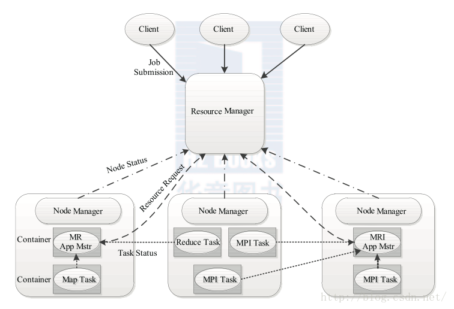
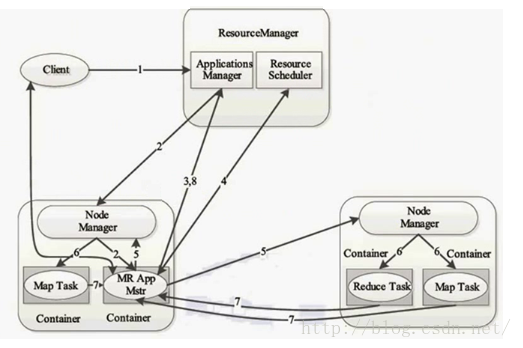

# YARN

YARN\(Yet Another Resource Negotiator,另一种资源协调者\)

## YARN的产生背景

Hadoop 1.0的弊端包括：

**1、扩展性差：**JobTracker同时兼备了资源管理和作业控制两个功能，这是整个系统的最大瓶颈，它严重制约了整个集群的扩展性。

**2、可靠性差：**JobTracker存在单点故障，JobTracker出现问题将导致整个集群不可用。

**3、资源利用率低：**资源无法在多个任务间共享或合理分配，导致无法有效利用各种资源。

**4、无法支持多种计算框架：**Hadoop 1.0只支持MapReduce这种离线批处理计算模式，而无法支持内存计算、流式计算、迭代式计算等。

正是由于Hadoop 1.0存在以上这些弊端，所以Hadoop 2.0推出了资源管理器YARN，有效解决了上述问题。

## YARN基本结构

YARN是Hadoop 2.0的资源管理器。它是一个通用的资源管理系统，可为上层应用提供统一的资源管理和调度，它的引入为集群在利用率、资源统一管理和数据共享等方面带来了巨大好处。

YARN的基本设计思想是将Hadoop 1.0中的JobTracker拆分成了两个独立的服务。一个全局的资源管理器ResourceManager和每个应用程序特有的ApplicationMaster。其中ResourceManager负责整个系统的资源管理和分配，而ApplicationMaster负责单个应用程序的管理，其基本架构如下图所示：

YARN总体上仍然是Master/Slave结构。在整个资源管理框架中，ResourceManager为Master，NodeManager为Slave，并通过HA方案实现了ResourceManager的高可用。ResourceManager负责对各个NodeManager上的资源进行统一管理和调度。当用户提交一个应用程序时，需要提供一个用以跟踪和管理这个程序的ApplicationMaster，它负责向ResourceManager申请资源，并要求NodeManger启动可以占用一定资源的任务。由于不同的ApplicationMaster被分布到不同的节点上，因此它们之间不会相互影响。

**ResourceManager：**它是一个全局的资源管理器，负责整个系统的资源管理和分配，主要由**调度器**和**应用程序管理器**两个组件构成。

* **调度器：**根据容量、队列等限制条件，将系统中的资源分配给各个正在运行的应用程序。调度器仅根据应用程序的资源需求进行资源分配，而资源分配单位用一个抽象概念“资源容器”（简称Container）表示，Container是一个动态资源分配单位，它将内存、CPU、磁盘、网络等资源封装在一起，从而限定每个任务使用的资源量。
* **应用程序管理器：**负责管理整个系统中所有的应用程序，包括应用程序提交、与调度器协商资源以启动ApplicationMaster、监控ApplicationMaster运行状态并在失败时重新启动它等。

ApplicationMaster：用户提交的每个应用程序均包含1个ApplicationMaster，主要功能包括与ResourceManager调度器协商以获取资源、将得到的任务进一步分配给内部的任务、与NodeManager通信以启动/停止任务、监控所有任务运行状态并在任务运行失败时重新为任务申请资源以重启任务等。

NodeManager：它是每个节点上的资源和任务管理器，它不仅定时向ResourceManager汇报本节点上的资源使用情况和各个Container的运行状态，还接收并处理来自ApplicationMaster的Container启动/停止等各种请求。

Container：它是YARN中的资源抽象，它封装了某个节点上的多维度资源，如内存、CPU、磁盘、网络等，当ApplicationMaster向ResourceManager申请资源时，返回的资源便是用Container表示的。YARN会为每个任务分配一个Container，且该任务只能使用该Container中描述的资源。

## YARN工作流

## 

步骤1：用户向YARN中提交应用程序，其中包括用户程序、ApplicationMaster程序、ApplicationMaster启动命令等。

步骤2：ResourceManager为应用程序分配第一个Container，并与对应的NodeManager通信，要求它在这个Container中启动应用程序的ApplicationMaster。

步骤3：ApplicationMaster首先向ResourceManager注册，这样用户可以直接通过ResourceManager查看应用程序的运行状态，然后ApplicationMaster为各个任务申请资源，并监控它们的运行状态，直到运行结束，即重复步骤4-7。

步骤4：ApplicationMaster采用轮询的方式通过RPC协议向ResourceManager申请和领取资源。

步骤5：一旦ApplicationMaster成功申请到资源，便开始与对应的NodeManager通信，要求它启动任务。

步骤6：NodeManager为任务设置好运行环境（包括环境变量、JAR包、二进制程序等）后，将任务启动命令写到一个脚本中，并通过运行该脚本启动任务。

步骤7：各个任务通过某个RPC协议向ApplicationMaster汇报自己的状态和进度，使ApplicationMaster能够随时掌握各个任务的运行状态，从而可以在任务失败时重新启动任务。在应用程序运行过程中，用户可随时通过RPC向ApplicationMaster查询应用程序的当前运行状态。

步骤8：应用程序运行完成后，ApplicationMaster通过RPC协议向ResourceManager注销并关闭自己。

## reference

* [https://blog.csdn.net/carl810224/article/details/51910975](https://blog.csdn.net/carl810224/article/details/51910975)

