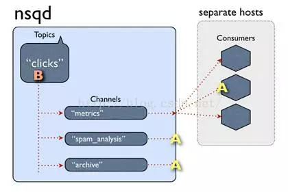

# NSQ

## NSQ

### features

* **Distributed :** NSQ提供了分布式的，去中心化，且没有单点故障的拓扑结构，稳定的消息传输发布保障，能够具有高容错和HA（高可用）特性。
* **Scalable易于扩展:**NSQ支持水平扩展，没有中心化的brokers。内置的发现服务简化了在集群中增加节点。同时支持pub-sub和load-balanced 的消息分发。
* **Ops Friendly** NSQ非常容易配置和部署，生来就绑定了一个管理界面。二进制包没有运行时依赖。官方有Docker image
* **Integrated高度集成** 官方的 Go 和 Python库都有提供。而且为大多数语言提供了库。

### 组件

nsq 有三个必要的组建nsqd、nsqlookupd、nsqadmin 其中nsqd 和 nsqlookup是必须部署的 下面我们一一介绍。

### **nsqd**

负责接收消息，存储队列和将消息发送给客户端，nsqd 可以多机器部署，当你使用客户端向一个topic发送消息时，可以配置多个nsqd地址，消息会随机的分配到各个nsqd上，nsqd优先把消息存储到内存channel中，当内存channel满了之后，则把消息写到磁盘文件中。他监听了两个tcp端口，一个用来服务客户端，一个用来提供http的接口 ，nsqd 启动时置顶下nsqlookupd地址即可：

```markup
nsqd --lookupd-tcp-address=127.0.0.1:4160
```

也可以指定端口 与数据目录，其他配置项可详见官网

```markup
nsqd --lookupd-tcp-address=127.0.0.1:4160 --broadcast-address=127.0.0.1 -tcp-address=127.0.0.1:4154 -http-address="0.0.0.0:4155" --data-path=/data/nsqdata
```

### nsqlookupd

主要负责服务发现 负责nsqd的心跳、状态监测，给客户端、nsqadmin提供nsqd地址与状态。是整个集群的总控室，包括服务发现和节点拓扑信息的管理。nsqlookupd有以下特点：

1. 唯一性,在集群中的节点只能指向唯一的nsqlookupd服务
2. 去中心化,即使nsqlookupd崩溃，也会不影响正在运行的nsqd服务
3. 充当nsqd和naqadmin信息交互的中间件
4. 提供一个http查询服务，给客户端定时更新nsqd的地址目录

### nsqadmin

nsqadmin是一个web管理界面 启动方式如下：

```markup
nsqadmin --lookupd-http-address=127.0.0.1:4161
```

### Topic

一个topic就是程序发布消息的一个逻辑键，当程序第一次发布消息时就会创建topic。

### Channels

channel与消费者相关，是消费者之间的负载均衡，channel在某种意义上来说是一个“队列”。每当一个发布者发送一条消息到一个topic，消息会被复制到所有消费者连接的channel上，消费者通过这个特殊的channel读取消息，实际上，在消费者第一次订阅时就会创建channel。Channel会将消息进行排列，如果没有消费者读取消息，消息首先会在内存中排队，当量太大时就会被保存到磁盘中。

### Message

消息构成了数据流的中坚力量，消费者可以选择结束消息，表明它们正在被正常处理，或者重新将他们排队待到后面再进行处理。每个消息包含传递尝试的次数，当消息传递超过一定的阀值次数时，我们应该放弃这些消息，或者作为额外消息进行处理。

## 常用工具类

* nsq\_to \_file：消费指定的话题（topic）/通道（channel），并写到文件中，有选择的滚动和/或压缩文件。
* nsq\_to \_http：消费指定的话题（topic）/通道（channel）和执行 HTTP requests \(GET/POST\) 到指定的端点。
* nsq\_to \_nsq：消费者指定的话题/通道和重发布消息到目的地 nsqd 通过 TCP。

## 拓扑结构

NSQ推荐通过他们相应的nsqd实例使用协同定位发布者，这意味着即使面对网络分区，消息也会被保存在本地，直到它们被一个消费者读取。更重要的是，发布者不必去发现其他的nsqd节点，他们总是可以向本地实例发布消息。


首先，一个发布者向它的本地nsqd发送消息，要做到这点，首先要先打开一个连接，然后发送一个包含topic和消息主体的发布命令，在这种情况下，我们将消息发布到事件topic上以分散到我们不同的worker中。

事件topic会复制这些消息并且在每一个连接topic的channel上进行排队，在我们的案例中，有三个channel，它们其中之一作为档案channel。消费者会获取这些消息并且上传到S3。



每个channel的消息都会进行排队，直到一个worker把他们消费，如果此队列超出了内存限制，消息将会被写入到磁盘中。Nsqd节点首先会向nsqlookup广播他们的位置信息，一旦它们注册成功，worker将会从nsqlookup服务器节点上发现所有包含事件topic的nsqd节点。


然后每个worker向每个nsqd主机进行订阅操作，用于表明worker已经准备好接受消息了。这里我们不需要一个完整的连通图，但我们必须要保证每个单独的nsqd实例拥有足够的消费者去消费它们的消息，否则channel会被队列堆着。

## NSQ**消息传递担保**

NSQ 保证消息将交付至少一次，虽然消息可能是重复的。消费者应该关注到这一点，删除重复数据或执行idempotent等操作。

这个担保是作为协议和工作流的一部分，工作原理如下（假设客户端成功连接并订阅一个话题）：

* 客户表示已经准备好接收消息
* NSQ 发送一条消息，并暂时将数据存储在本地（在 re-queue 或 timeout）
* 客户端回复 FIN（结束）或 REQ（重新排队）分别指示成功或失败。如果客户端没有回复, NSQ 会在设定的时间超时，自动重新排队消息

这确保了消息丢失唯一可能的情况是不正常结束 nsqd 进程。在这种情况下，这是在内存中的任何信息（或任何缓冲未刷新到磁盘）都将丢失。

如何防止消息丢失是最重要的，即使是这个意外情况可以得到缓解。一种解决方案是构成冗余 nsqd对（在不同的主机上）接收消息的相同部分的副本。因为你实现的消费者是幂等的，以两倍时间处理这些消息不会对下游造成影响，并使得系统能够承受任何单一节点故障而不会丢失信息。

## **消除单点故障**

NSQ被设计以分布的方式被使用。nsqd 客户端（通过 TCP ）连接到指定话题的所有生产者实例。没有中间人，没有消息代理，也没有单点故障。  
这种拓扑结构消除单链，聚合，反馈。相反，你的消费者直接访问所有生产者。从技术上讲，哪个客户端连接到哪个 NSQ 不重要，只要有足够的消费者连接到所有生产者，以满足大量的消息，保证所有东西最终将被处理。对于 nsqlookupd，高可用性是通过运行多个实例来实现。他们不直接相互通信和数据被认为是最终一致。消费者轮询所有的配置的 nsqlookupd 实例和合并 response。失败的，无法访问的，或以其他方式故障的节点不会让系统陷于停顿。

## **心跳和超时**

NSQ 的 TCP 协议是面向 push 的。在建立连接，握手，和订阅后，消费者被放置在一个为 0 的 RDY 状态。当消费者准备好接收消息，它更新的 RDY 状态到准备接收消息的数量。NSQ 客户端库不断在幕后管理，消息控制流的结果。每隔一段时间，nsqd 将发送一个心跳线连接。客户端可以配置心跳之间的间隔，但 nsqd 会期待一个回应在它发送下一个心跳之前。

组合应用级别的心跳和 RDY 状态，避免头阻塞现象，也可能使心跳无用（即，如果消费者是在后面的处理消息流的接收缓冲区中，操作系统将被填满，堵心跳）为了保证进度，所有的网络 IO 时间上限势必与配置的心跳间隔相关联。这意味着，你可以从字面上拔掉之间的网络连接 nsqd 和消费者，它会检测并正确处理错误。当检测到一个致命错误，客户端连接被强制关闭。在传输中的消息会超时而重新排队等待传递到另一个消费者。最后，错误会被记录并累计到各种内部指标。

## 分布式

因为NSQ没有在守护程序之间共享信息，所以它从一开始就是为了分布式操作而生。个别的机器可以随便宕机随便启动而不会影响到系统的其余部分，消息发布者可以在本地发布，即使面对网络分区。

这种“分布式优先”的设计理念意味着NSQ基本上可以永远不断地扩展，需要更高的吞吐量？那就添加更多的nsqd吧。唯一的共享状态就是保存在lookup节点上，甚至它们不需要全局视图，配置某些nsqd注册到某些lookup节点上这是很简单的配置，唯一关键的地方就是消费者可以通过lookup节点获取所有完整的节点集。清晰的故障事件——NSQ在组件内建立了一套明确关于可能导致故障的的故障权衡机制，这对消息传递和恢复都有意义。虽然它们可能不像Kafka系统那样提供严格的保证级别，但NSQ简单的操作使故障情况非常明显。

## **no replication**

不像其他的队列组件，NSQ并没有提供任何形式的复制和集群，也正是这点让它能够如此简单地运行，但它确实对于一些高保证性高可靠性的消息发布没有足够的保证。我们可以通过降低文件同步的时间来部分避免，只需通过一个标志配置，通过EBS支持我们的队列。但是这样仍然存在一个消息被发布后马上死亡，丢失了有效的写入的情况。

## **没有严格的顺序**

虽然Kafka由一个有序的日志构成，但NSQ不是。消息可以在任何时间以任何顺序进入队列。在我们使用的案例中，这通常没有关系，因为所有的数据都被加上了时间戳，但它并不适合需要严格顺序的情况。

## **无数据重复删除功能**

NSQ对于超时系统，它使用了心跳检测机制去测试消费者是否存活还是死亡。很多原因会导致我们的consumer无法完成心跳检测，所以在consumer中必须有一个单独的步骤确保幂等性。

### reference

* [http://kuangjue.com/article/250](http://kuangjue.com/article/250)
* [https://mp.weixin.qq.com/s/lrbIx88Z1HwWNTO\_5aABJQ](https://mp.weixin.qq.com/s/lrbIx88Z1HwWNTO_5aABJQ)

