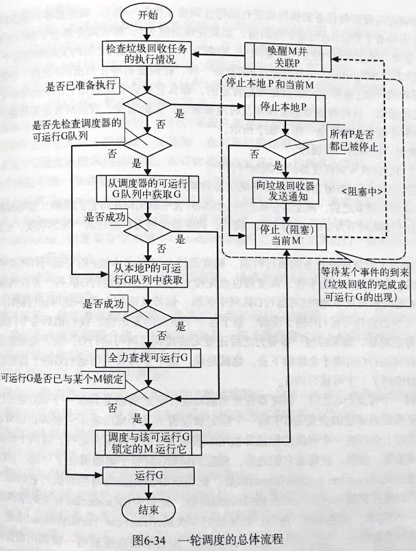

# Golang线程模型

## go线程模型

M:Machine 一个M代表了一个内核线程

P:Processor 一个P代表了M所需要的上下文环境

G:Goroutine 一个G代表了对一段需要被并发执行的Go语言代码的封装。

一个G的执行需要M和P的支持。一个M在与一个P关联之后就形成了一个有效的G运行环境（内核线程+上下文环境）。每个P都会包含一个和运行的G的队列\(runq 注释1.\)，该队列中的G会被依次传递给与本地P关联的M并获得运行时机。

_洺吉Q：为啥是runq 而不是 rung呢？可能这个q是queue的意思，而不是gorountine的意思。_

M与KSE（内核调度实体）之间总是一对一的。一个M能且仅能代表一个内核线程。Go语言的运行时系统\(runtime system\)用它来代表一个内核调度实体。M与KSE之间的关联是非常稳固的。也就是说，在一个M的生命周期内，它仅会与一个KSE产生关联。M与P以及P与G之间的关联都是易变的。它们之间的关系会在实际调度的过程中被改变。其中M与P之间是一对一的，P与G之间是一对多的。

### M Machine 一个M代表了一个内核线程

M的部分结构：

```go
type M struct {
    curg      // 存放当前M正在运行的那个G的指针，
    p         // 字段p会指向当前M相关联的P
    mstartfn  // M的起始函数
    nextp     // 暂存与当前有潜在关联关系的P
}
```

M在被创建之初会被加入到全局的M列表\(runtime.allm 注释2.\)中，紧接着， 它的起始函数和准备关联的P会被设置。最后，runtime system会为它专门创建一个新的内核线程并与之关联。这样，这个新的M就为执行G做好了准备。其中，起始函数仅当runtime system要用此M执行系统监控或者垃圾回收等任务的时候才会被设置。而这里的全局M队列其实并没有什么特殊的意义。runtime system在需要的时候会通过它获取到所有的M的信息。同时它也可以防止M被当做垃圾回收掉。

在新的M被创建完成之后会先进行一番初始化工作。其中包括了对自身所持的栈空间以及信号处理方面的初始化。在这些初始化工作都完成之后，该M的起始函数会被执行。如果这个起始函数代表的是系统监控任务的话，那么该M会一直在那里执行而不会继续后面的流程。否则，在初始函数被执行完毕之后，当前M将会和准备与它关联的P完成关联。至此，一个并发执行环境才真正形成。

runtime system所管辖的M\(runtime.allm中的M\)有时候会被停止，比如在运行时系统准备开始执行垃圾回收任务的时候。运行时系统在停止M的时候，会对它的属性进行必要的重置。之后，把它放入调度器的空闲M列表\(runtime sched.midle\)，在需要一个未被使用的M的时候，runtime system会尝试从该列表中获取。

M本身是无状态的。M是否空闲仅以它是否存在于调度器的空闲M列表中为依据。虽然runtime system可以通过runtime.allm获取到所有M，但是却无法得知它们的状态。

单个Go程序所使用的M的最大数量是可以被设置的。初始值是10000，也就是说一个GO程序最多可以使用10000个M。这意味着，在最理想的情况下，同时可以有10000个内核线程被同时运行。

同时还可以调用runtime/debug包中的SetMaxThreads函数设置M的最大数量。

洺吉S：其实从设置M的最大数量的参数是SetMaxThreads可以看出，M其实就是对应的操作系统线程。Go语言相当于在系统Thread和Go Thread之间包了一层，这一层就是M。通过M可以间接对操作系统Thread所运行的代码进行控制和调度。

### P Processor 一个P代表了M所需要的上下文环境

P是使G能够在M中运行的关键。Go语言的runtime system会适时地让P与不同的M建立或者断开关联。以使P中的那些可以运行的G能够在需要的时候及时获得运行时机。这与操作系统内核在CPU之上实时切换不同的进程或线程的情形是类似的。

通过调用函数runtime.GOMAXPROCS，我们可以改变单个Go程序可以间接拥有的P的最大数量。

每个P都需要关联一个M才能使其中的可运行G得到执行。但是这却不意味着GOMAXPROCS的值会限制住M的总数量。当M因系统调用的进行而被阻塞的时候，runtime system会将该M和与之关联的P分开来。这时，如果这个P的可运行G队列中还有未被运行的G，那么runtime system就会找到一个空闲的M，或创建出一个新的M，并与该P关联以满足这些G的运行需要。如果我们在Go程序中创建的大部分Goroutine中都包含了很多需要间接地进行各种系统调用的代码的话，那么即使GOMAXPROCS的值被谁定为1，也可能会有很多个M被创建出来。所以，实际的M总数量很可能比GOMAXPROCS所指代的数量多。

在确定P的最大数量之后，runtime system会根据这个数值初始化全局的P列表\(runtime.allp\)。与全局M列表类似，该列表中包含了当前runtime system所创建的所有P。随后，runtime system会把调度器的可运行G队列\(runtime.sched.runq\)中的所有G均匀的放入到全局P列表中的各个P的可运行G队列当中。至此，runtime system所需要的所有P都已就绪。

与空闲M列表类似，在runtime system中也存在这一个调度器的空闲P列表\(runtime.sched.pidle\)。当一个P不在与任何M关联的时候，runtime system就会不它放入到该列表中。而当runtime system需要一个空闲的P关联某个M的话，会从此列表中取出一个。

P本身是有状态的，其可能具有的状态如下：

* Pidle:         表明P未与任何M存在关联。
* Prunning:  表明当前P正在与某个M关联。
* Psyscall:   表明当前P中的被运行的那个G正在进行系统调用。
* Pgcstop:   表明runtime system正在进行垃圾回收。在runtime system进行垃圾回收的时候，会试图把全局的P列表中的都置于此状态。
* PDead:      表明P已经不会再被使用。

除了Pdead之外的所有状态的P都会在runtime system将要进行垃圾回收的时候被置为Pgcstop状态。但是等到垃圾回收结束之后，它们并不会被恢复至原有状态，而会被统一地转换为Pidle状态，重新进行调度。

每一个P中都有一个可运行G队列，它们还都包含了一个自由G列表\(gfree\)。其中包含了一些已经被运行完成的G。随着被运行完的G的增多，该列表可能会很长。如果它增长到一定程度。runtime system会把其中的部分G转移到调度器的自由G列表\(runtime.sched.gfree\)中。当我们使用go语句欲启用一个G的时候，runtime system会先试图从相应的P的自由G列表中获取一个现呈的G来封装我们提供的函数，仅当获取不到这样的一个G的时候才会有可能去创建一个新的G。runtime system如果发现这个过程中自由G太少，则会先尝试从调度器的自由G列表中转移过来一些G。

### G Goroutine 一个G代表了对一段需要被并发执行的Go语言代码的封装。

Go语言的编译器会把我们编写的go语句编程一个runtime system中的函数调用，并把go语句中的那个函数及其参数都作为参数传递给这个runtime system中的函数。

runtime system在接到这样一个调用之后，会先检查一下go函数及其参数的合法性。紧接着会视图从本地P的自由G列表和调度器的自由G列表获取可用的G。如果没有获取到就会新建一个G。与M和P相同，runtime system也持有一个G的全局列表\(runtime.allg\)。新建的G会在第一时间被加入到该列表中。类似地，该列表的主要作用也是集中存放当前runtime system中的所有G的指针。之后，runtime system会对G进行一次初始化。其中包括了关联go函数以及设置该G的状态和ID等步骤。在初始化完成后，这个G会被放入本地P的可运行队列中。如果时机成熟，调度会立即进行以使这个G尽快被运行。

G的状态列表如下：

* Gidle：         当前G被创建但还未被初始化的时候会处于此状态。
* Grunnable：表示当前G是可以运行的，并且正在等待被运行。
* Grunning：  表示当前G正在被运行。
* Gsyscall:      表示当前G正在进行系统调用。
* Gwaiting：  表示当前G正因某个原因而等待。
* Gdead：      表示当前G已经被运行完成。

在runtime system想用一个G封装我们通过go语句递交的go函数的时候，会先对这个G进行初始化。其中的一步就是初始化这个G的状态，初始化成runnable。

一个G在被运行的过程当中，是否会等待某个事件以及等待什么样的事件，完全由其封装的go函数决定。例如，如果这个函数中包含了对通道类型值的操作，那么在执行到对应的代码的时候这个G就有可能进入Gwaiting状态。又例如，涉及网络或者IO的时候也会导致相应的G进入Gwaiting状态。在事件到来之后，G会被唤醒并转换至Grunnable状态。待时机到来时，它会被再次运行。

### 核心元素的容器

M、P、G容器

| 中文名称 | 源码中的名称 | 作用域 | 概要 |
| :--- | :--- | :--- | :--- |
| 全局M列表 | runtime.allm | runtime system | 存放所有的M的列表 |
| 全局P列表 | runtime.allp | runtime system | 存放所有的P的列表 |
| 全局G列表 | runtime.allg | runtime system | 存放所有的G的列表 |
| 调度器的空闲M列表 | runtime.sched.midle | 调度器 | 存放空闲M的列表 |
| 调度器的空闲P列表 | runtime.sched.pidle | 调度器 | 存放空闲P的列表 |
| 调度器的可运行G列表 | runtime.sched.gfree | 调度器 | 存放可运行G的列表 |
| 调度器的自由G列表 | runtime.sched.gfree | 调度器 | 存放自由G的列表 |
| P的可运行G队列 | runq | 本地P | 当前P中的可运行G列表 |
| P的自由G队列 | gfree | 本地P | 当前P中的自由G列表 |

全局的3个列表存在的主要目的都是为了统计runtime system中的所有M、P、G。

runtime system创建出的任何G都会存在于全局G列表中。而其余4个G列表则只会存放在当前作用域内的具有特定状态的G。这里的两个可运行G列表中的G都拥有几乎平等的运行机会。在调度时会先后对它们进行检查，并会立即运行第一个被发现的可运行的G。

## 调度器

两级线程模型中的一部分调度任务会由操作系统内核之外的程序承担。

调度器的基本结构：

```go
gcwaiting  uint32  // 作为垃圾回收任务被执行期间的辅助标记、停止计数和通知机制。
stopwait   int32   //
stopnote   Note
sysmonwait uint32  // 作为系统检测任务被执行期间的停止计数和通知机制。
sysmonnote Note
```

字段gcwaiting、stopwait和stopnote都是runtime system中垃圾回收器在进行垃圾回收时的辅助协调手段之一。由调度器的字段gcwaiting的值，我们可以知道垃圾回收器是否已经开始准备或正在进行垃圾回收。stopwait字段是为了对还未被停止调度的P进行计数。当该计数为0的时候，就说明调度工作已经完全停止。这时，垃圾回收器会立即开始执行垃圾回收任务。而stopNote字段就是被用来向垃圾回收器告知调度工作已经完全被停止的通知机制的重要部分。

这些辅助协调手段存在的意义在于保证所有的P在垃圾回收期间都处于Pgcstop状态。这样有助于最大化垃圾回收的效果。

go垃圾回收器的做法是：

* 先停止一切调度工作\(包括停止对M和P的调度\): 先把调度器的gcwaiting字段置为1，这是为了告诉调度器，它已经开始准备执行垃圾回收任务。垃圾回收器会利用stopnote字段将自身阻塞住，以等待调度器完全停止调度。
* 调度器在发现gcwaiting字段的值被设置为1之后，会积极响应，并陆续停止调度工作。到所有的调度工作均已停止\(此时作为计数器的stopwait字段值变成0\)，调度器会利用stopnote字段向垃圾回收器发送通知。
* 垃圾回收器在收到通知之后（通知机制底层是通过信号灯来实现的），进行垃圾回收。
* 回收完成之后再重启调度工作。

Go语言的垃圾回收任务是在"Stop the world"的环境下被执行的。

sysmonwait, sysmonnote主要用于系统检测任务。在垃圾回收器进行垃圾回收的时候，被持续执行的系统监测任务也需要被暂停。这两个字段的作用就是及时地暂停和恢复系统监测任务的执行。 sysmonwait字段表示系统监测任务是否已被暂停的标记，而 sysmonnote字段则是被用来向执行系统检测任务的程序发送通知的。

系统监测任务是被持续执行的。它被置于了无限的循环当中，每次迭代前都会检查调取器的gcwaiting字段的值，若为1，则说明垃圾回收器已经开始准备或正在执行垃圾回收任务。这时，系统监测器会先将调度器的sysmonwait字段的值设置为1表示系统监测任务已经被暂停。然后利用sysmonnote字段阻塞自身以等待垃圾回收的完成。在调度系统被重启之后，调度器若发现sysmonwait字段值为1则会利用sysmonnote字段向监测系统发送通知。系统监测器在收到该通知之后会立即执行当次迭代的后续流程并继续进行之后的迭代。

### 

### g0和m0

runtime system中每个M都会拥有一个特殊的Gorountine--g0。它不是由Go程序中的代码（go语句）间接生成的，而是runtime system在初始化M期间创建并分配给M的。g0内含了各种调度、垃圾回收和栈管理等程序。

除了g0之外，其他由M运行的G都可以被视作用户级别的G。用户级别的G可以被简称为用户G，而g0则可以被称为系统G。在通常情况下，M会运行用户G。不过，g0也会时不时地被切换和运行以执行前面说到的那些管理性质的任务。这就是每个M都会运行调度程序的根本原因。与用户G不同，g0不会被阻塞，也不会被包含在任何特殊的G队列或者列表中。同时，它的栈也不会在垃圾回收期间被扫描。

除了每个M都有属于自己的g0之外，还存在一个runtime.g0。runtime.g0被用于执行引导程序。它是在Go程序所间接拥有的第一个内核线程中被运行的。这个内核线程也被成为runtime.m0。runtime.m0和runtime.g0都是被静态分配的，因此引导程序也无需为它们分配内存。

### 调度器跟踪

系统监测器可以在必要的时候打印出调度器的跟踪信息。我们可以通过设置GODEBUG来对此进行控制。

`export GODEBUG=schedtrace=2000,scheddetail=1`

环境变量GODEBUG的值可以由若干个键值对组成。

schedtrace的值为X的时候，就意味着系统监视器会每X毫秒打印一个单行信息到操作系统的错误输出上。包含了调度器状态的概要。

scheddetail的值为1的时候，那么系统监测器会在上述信息的基础上多打印一行信息，其中包括了调度器以及所有的现存的M、P和G的状态。

## reference

* 《GO并发编程实战》

