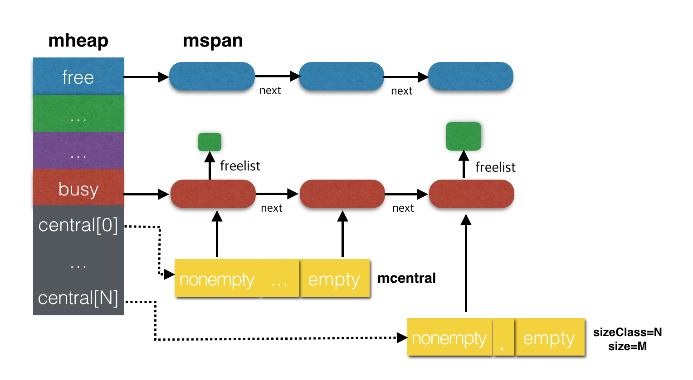

# Heap内存模型

## Heap管理

内置runtime system的编程语言通常会抛弃传统的内存分配方式,改由自主管理内存。这样可以完成类似预分配、内存池等操作,以避开频繁地申请、释放内存产生过多的系统调用而导致的性能问题。当然,还有一个重要原因是为了更好地配合语言的垃圾回收机制。

Go内部实现也不例外，go runtime接管了所有的内存申请和释放动作。在os上层实现了内存池机制\(源自tcmalloc设计\)。

Go内存池管理的核心数据结构为mHeap。该结构管理从os申请的大块内存，将大块内存切分成多种不同大小的小块，每种小块由数据结构mspan表示。mheap通过数组+链表的方式来维护所有的空闲span。

应用程序在申请内存时一般都是以object为单位。在go runtime内部必须要计算object大小，然后找到合适的mspan大小。从这里面分配出想要的内存，返回给应用程序。

程序在向go runtime申请分配某种object所需内存时，会计算出object占用的内存空间，然后找到最接近的mspan\(因为mspan管理的块大小是按照固定倍数增长的方案。如一个17字节的object需要的块大小应该是24字节，存在轻微的内存浪费\)，将其分配出去。

## 核心数据结构

Go内存管理模块的核心数据结构:

* mFixAlloc 
* mheap
* mspan
* mcache
* mcentral

### 数据结构关系图

1. mheap管理向os申请、释放、组织mspan；
2. mcentral按照自己管理的块大小将mspan分配给mcache；
3. mspan是数据的实际存储区域，按照mcentral管理的块规格被切分成小block, sizeClass。
4. mcache管理不同规格\(块大小\)的mspan：规格相同的mspan被链接到同一个链表中。

### 参考

* [https://tracymacding.gitbooks.io/implementation-of-golang/content/](https://tracymacding.gitbooks.io/implementation-of-golang/content/)
* [http://legendtkl.com/2017/04/02/golang-alloc/](http://legendtkl.com/2017/04/02/golang-alloc/)

