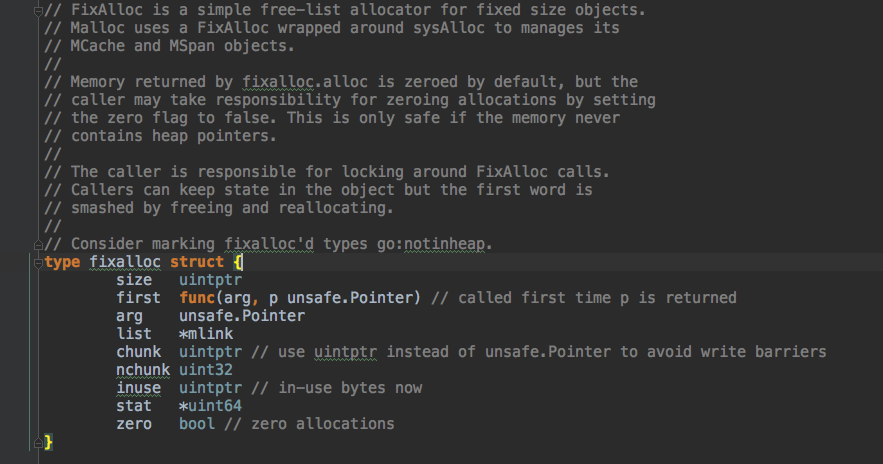

# mFixAlloc

## runtime/mfixalloc.go

`list`指针上挂的一个链表，这个链表的每个节点是一个固定大小的内存块，cachealloc中的list存储的内存块大小为`sizeof(MCache)`，而spanalloc中的list存储的内存块大小为`sizeof(MSpan)`。`chunk`指针始终挂载的是一个128k大的内存块。 FixAlloc提供了三个API，分别是runtime·FixAlloc\_Init、runtime·FixAlloc\_Alloc和runtime·FixAlloc\_Free。

使用FixAlloc分配MCache和MSpan对象的时候，首先是查找FixAlloc的list链表，如果list不为空，就直接拿一个内存块返回使用; 如果list为空，就把焦点转移到chunk上去，如果128k的chunk内存中有足够的空间，就切割一块内存出来返回使用，如果chunk内存没有剩余内存的话，就从操作系统再申请128k内存替代老的chunk。FixAlloc的固定对象分配逻辑就这么简单，相反释放逻辑更简单了，释放的对象就是直接放到list中，并不会返回给操作系统。当然mcache的个数基本是稳定的，也就是底层线程个数，但span对象就不一定那么稳定了，所以FixAlloc的内存可能增长的因素就是span的对象太多。

_洺吉：我看代码好像chunk的大小是16k的呀。\_FixAllocChunk = 16 &lt;&lt; 10 // Chunk size for FixAlloc 这不是16K吗？_

