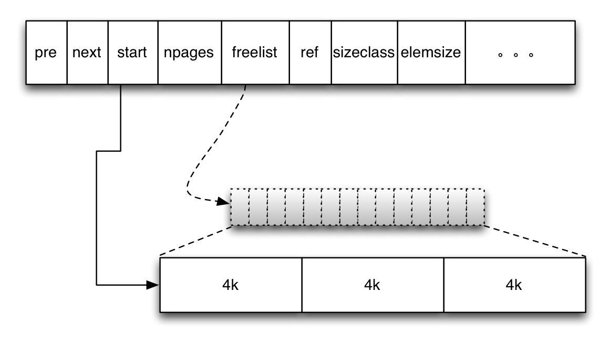

# mspan

span由多个地址连续的页（Page 4K大小的内存块）组成的大内存块。span 在 tcmalloc 中作为一种管理内存的基本单位而存在。

npages 表示是此span存储的page的个数，`start`可以看作一个page指针，指向第一个page，有了第一个page当然就可以算出后面的任何一个page的起始地址了，因为span管理的始终是连续的一组page。这里需要注意start的类型是PageID，由此可以看出这个start保存的并不是第一个page的起始地址，而是第一个page的id值。这个id值是如何算出来的呢？其实给每个page算一个id，是非常简单的事情，只要将这个page的的地址除以4096取整\(伪代码：`page_addr>>20`\)即可，当然前提是已经保证好了每个page按4k对齐。是不是觉得很精妙，这样一来每个page都有一个整数id了，并且任何一个内存地址都可以通过移位算出这个地址属于哪个page，这个很重要。

`sizeclass`如果是0的话，就代表这个span是用来分配大对象的，其他值都是分配小对象了。在分配小对象的时候，start字段维护的所有page，最后将会被切分成一个一个的连续内存块，内存块大小当然就是小对象的大小，这些切分出来的内存块将被链接成为一个链表挂在freelist字段上。分配大对象的时候，freelist就没什么用了。size为3的话，那么就它将被分成32byte的小块。因为0,1,2,3分别对应分成0,8byte,16byte,32byte。

