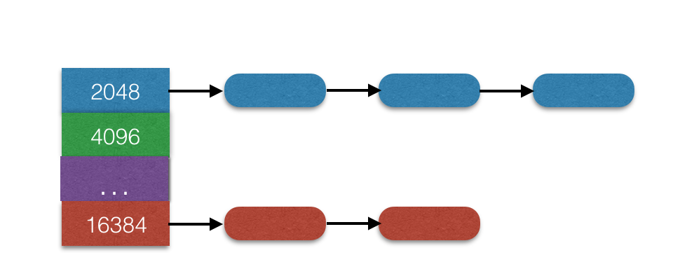
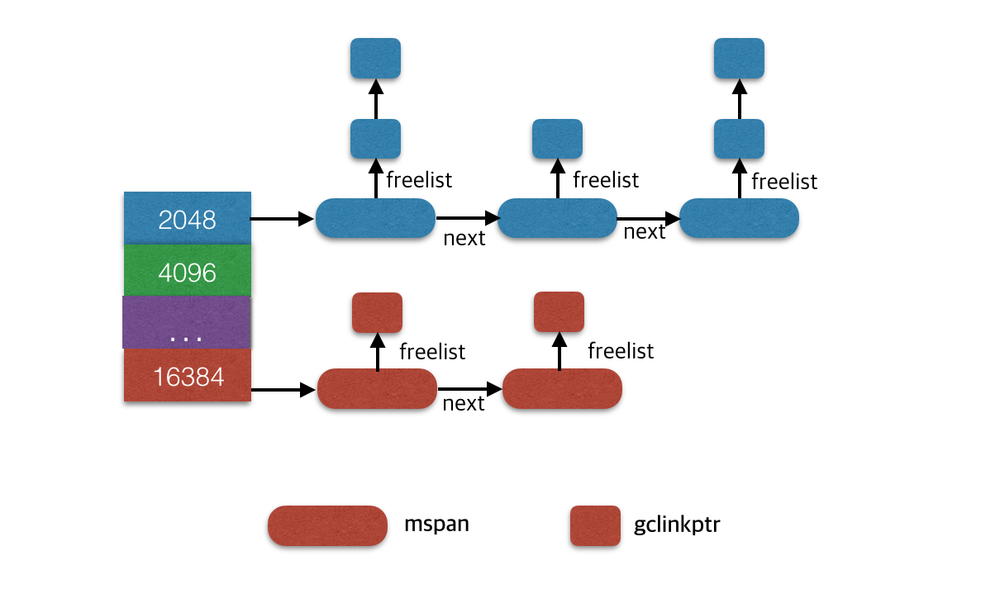

# Stack内存

## Stack内存管理

要启动go协程，必须要为其准备栈空间，用来存储函数内变量、执行函数调用等。在go协程退出后，其占用的stack内存也会随之一同释放。

实际应用中协程的启动、退出可能会比较频繁，runtime必须要做点什么来保证启动、销毁协程的代价尽量小。而申请、释放stack空间所需内存则是一个比较大的开销，因此，go runtime采用了**stack cache pool**来缓存一定数量的stack memory。申请时从stack cache pool分配，释放时首先归还给stack cache pool。

## 主要思想

stack cache pool的主要思想是按照固定大小划分成多级：每级别其实是一个空闲stack队列：最小的stack size是\_FixedStack=2KB。级别之间的大小按照2倍的关系递增。

同时为了效率考虑，除了全局的stack cache pool外，每个线程m还有自己的stack cache。这样，线程在分配的时候可以优先从自己的stack cache中查找，提高效率。

初始时，stack cache pool为空：当有stack分配需求时，首先向os申请一块较大的内存，将其按照该级别的stack大小切割后放在空闲stack列表上，然后再从该空闲stack列表上分配。主要结构如下：这里的分配算法思想是: （stack cache pool -&gt; local stack cache -&gt; stack）

1. 如果线程m的local stack cache不为空，则从local stack cache中进行分配
2. 如果线程m的local stack cache为空，则需要先给线程m分配出一批stack，再从线程m的local stack cache中进行分配.

分配后的系统stack cache pool结构如下：

## 参考

* [https://tracymacding.gitbooks.io/implementation-of-golang/content/](https://tracymacding.gitbooks.io/implementation-of-golang/content/)

