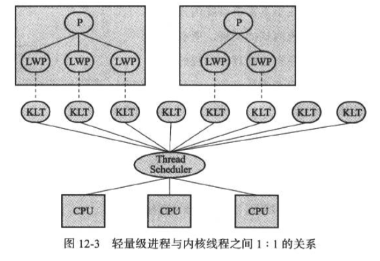
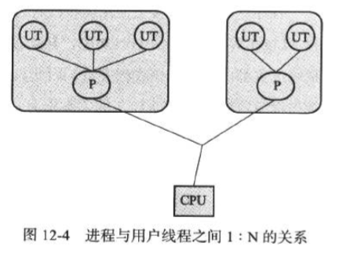
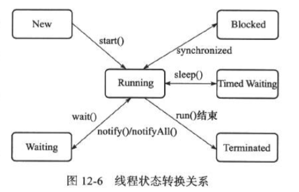

# Java线程调度

## 线程的实现

实现线程的方式主要有3种，1. 使用内核线程实现 2. 使用用户线程实现 3. 使用用户线程加轻量级线程混合实现

### 使用内核线程实现

内核线程（Kernel-Level Thread， KLT）就是直接由操作系统内核（Kernel）支持的线程，这种线程由内核来完成线程切换，内核通过调度器对线程进行调度，并负责将线程的任务映射到各个处理器上。每个内核线程可以视为内核的一个分身，这样操作系统就有能力同时处理多件事情。

程序一般不会直接去使用内核线程，而是去使用内核线程的一种高级接口——轻量级进程（Light Weight Process， LWP）轻量级进程就是我们通常意义上所讲的线程，由于每个轻量级进程都由一个内核线程支持，因此只有先支持内核线程，才能有轻量级进程。这种轻量级进程与内核线程之间1：1的关系成为一对一的线程模型。

由于内核线程的支持，每个轻量级进程都成为一个独立的调度单元，即使有一个轻量级线程在系统调用中阻塞了，也不会影响整个进程的工作，但是轻量级进程具有它的局限性：首先，由于是基于内核线程实现的，所以各种线程操作，如创建、析构及同步，都需要进行系统调用。而系统调用的代价相对较高，需要在用户态和内核态中来回切换。其次，每个轻量级进程都需要有一个内核线程的支持，因此轻量级进程要消耗一定的内核资源，因此一个系统支持轻量级进程的数量是有限的。

### 使用用户线程实现

狭义上的用户线程指的是完全建立在用户空间的线程库上，系统内核不能感知线程存在的实现。用户线程的建立、同步、销毁和调度完全在用户态中完成，不需要内核的帮助。如果在程序实现得当，这种线程不需要切换到内核态，因此操作可以是非常快速且低消耗的，也可以支持规模更大的线程数量。这种进程与用户线程之间1：N的关系称为一对多的线程模型。

使用用户线程的优势在于不需要系统内核支援，劣势也在于没有系统内核的资源，所有线程操作都需要用户程序自己处理。线程的创建、切换和调度都是需要考虑的问题。而且由于操作系统只把处理器资源分配到进程，那诸如“阻塞如何处理”、“多处理器系统中如何将线程映射到其他处理器上”这类问题解决起来将会异常困难，甚至不可能完成。因而使用用户线程实现的程序一般都比较复杂。Java、Ruby等语言都曾经使用过用户线程，最终又放弃使用它。

### 使用用户线程加轻量级进程混合实现

线程除了依赖内核线程实现和完全由用户程序自己实现之外，还有一种将内核线程与用户线程一起使用的实现方式。在这种混合实现下，既存在用户线程，也存在轻量级进程。用户线程还是完全建立在用户空间中，因此用户线程的创建、切换、析构等操作依然廉价，并且可以支持大规模的用户线程并发。而操作系统提供支持的轻量级进程则作为用户线程和内核线程之间的桥梁，这样可以使用内核提供的线程调度功能以及处理器映射，并且用户线程的系统调用要通过轻量级线程来完成，大大降低了整个进程被完全阻塞的风险。这种混合模式中，用户线程与轻量级进程的数量比是不定的，即为N:M的关系。

## Java 线程调度

线程调度是指系统为线程分配处理器使用权的过程，主要调度方式有两种，分别是协同式线程调度\(Cooperative Threads-Scheduling\)和抢占式线程调度\(Preemptive Threads-Scheduling\)。

如果使用协同式调度的多线程系统，线程的执行时间由线程本身来控制，线程把自己的工作执行完了之后，要主动通知系统切换到另一个线程上。协同式多线程的最大好处是实现简单，而且由于线程要把自己的事情干完后才会进行线程切换，切换操作对线程自己是可知的，所以没有线程同步的问题。Lua语言中的“协同线程”就是这类实现。它的坏处也很明显：线程执行时间不可控制，甚至如果一个线程编写有问题，一直不告诉系统进行线程切换，那么程序会一直阻塞在那里。

如果使用抢占式调度的多线程系统，那么每个线程将由系统来分配执行时间，线程的切换不由线程本身来决定。在这种实现线程调度的方式下，线程的执行时间是系统可控的，也不会有一个线程导致整个进行阻塞的问题。Java使用的线程调度方式就是抢占式调度。

虽然Java线程调度是系统自动完成的，但是我们还是可以“建议”系统给某些线程多分配一点执行时间，另外的一些线程则可以少分配一点——这项操作可以通过设置线程优先级来完成。Java语言一共设置了10个级别的线程优先级（Thread.MIN\_PRIORITY至Thread.MAX\_PRIORITY）。在两个线程同时处于Ready状态时，优先级越高的线程越容易被系统选择执行。

## Java线程状态转换

Java语言定义了5种线程状态，在任意一个时间点，一个线程只能有且只有其中一种状态，这5种状态分别为：

### 新建 New

创建后尚未启动的线程处于这种状态

### 运行 Runable

Runable 包括了操作系统线程状态中的Running和Ready，也就是处于此状态的线程有可能正在执行，也有可能正在等待着CPU为它分配执行时间。

### 无限期等待 Waiting

处于这种状态的线程不会被分配CPU执行时间，它们要等待被其他线程显示地唤醒。以下方法会让线程陷入无限期的等待状态：

* 没有设置Timeout参数的Object.wait\(\)方法。
* 没有设置Timeout参数的Object.join\(\)方法。
* LockSupport.park\(\)方法

### 限期等待 Timed Waiting

处于这种状态的线程也不会被分配CPU执行时间，不过无需等待被其他线程显示地唤醒，在一定时间之后它们会由系统自动唤醒。以下方法会让线程进入限期等待状态

* Thread.sleep\(\)方法
* 设置了Timeout参数的Object.wait\(\)方法
* 设置了Timeout参数的Thread.join\(\)方法
* LockSupport.parkNanos\(\)方法
* LockSupport.parkUntil\(\)方法

### 阻塞 Blocked

线程被阻塞了，“阻塞状态”与“等待状态”的区别是：“阻塞状态”在等待着获取一个排他锁，这个事件将在另外一个线程放弃这个锁的时候发生；而“等待状态”则是在等一段时间，或者唤醒动作的发生。在程序等待进入同步区域的时候，线程将进入这种状态。

### 结束 Terminated

已终止线程的线程状态，线程已经结束执行。

## reference

* 《深入理解Java虚拟机——JVM高级特性与最佳实践（第二版）》

