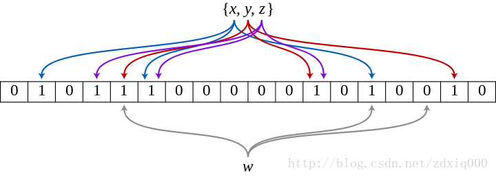

# 布隆过滤器

布隆过滤器\(Bloom Filter\)是一种节省空间的概率数据结构，由Burton Howard Bloom在1970年提出，用来测试一个元素是否在一个集合里。对布隆过滤器的一次查询要么返回“可能在集合中“，要么”肯定不在集合里“。所以布隆过滤器可能会“错报”，但是不会“漏报”。

## Bloom Filter原理

Bloom Filter 是一种空间效率很高的随机数据结构，Bloom filter 可以看做是对 bit-map 的扩展, 它的原理是：

当一个元素被加入集合时，通过`K`个`Hash 函数`将这个元素映射成一个`位阵列（Bit array）中的 K 个点`，把它们置为`1`。检索时，我们只要看看这些点是不是都是 1 就（大约）知道集合中有没有它了：

* 如果这些点有任何一个 0，则被检索元素**一定不在**；
* 如果都是 1，则被检索元素**很可能**在。

## Bloom Filter示例

下图中是k=3时的布隆过滤器:

x, y, z 经由哈希函数映射将各自在Bitmap中的3个位置置为1。当w 出现时，仅当3个标志位都为1时，才表示w在集合中。图中所示的情况，布隆过滤器将判定w不在集合中。

## 优点

It tells us that the element either definitely is not in the set or may be in the set.

它的优点是`空间效率`和`查询时间`都远远超过一般的算法，布隆过滤器存储空间和插入 / 查询时间都是常数`O(k)`。另外, 散列函数相互之间没有关系，方便由硬件并行实现。布隆过滤器不需要存储元素本身，在某些对保密要求非常严格的场合有优势。

## 缺点

但是布隆过滤器的缺点和优点一样明显。误算率是其中之一。随着存入的元素数量增加，误算率随之增加。但是如果元素数量太少，则使用散列表足矣。

## reference

* [https://blog.csdn.net/zdxiq000/article/details/57626464](https://blog.csdn.net/zdxiq000/article/details/57626464)
* [https://segmentfault.com/a/1190000002729689](https://segmentfault.com/a/1190000002729689)

