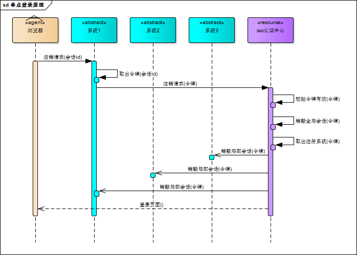

# SSO

## 单系统登录机制

### http无状态协议

web应用采用browser/server架构，http作为通信协议。http是无状态协议，浏览器的每一次请求，服务器会独立处理，不与之前或之后的请求产生关联，请求/响应对之间没有任何联系。

这也同时意味着，任何用户都能通过浏览器访问服务器资源，如果想保护服务器的某些资源，必须限制浏览器请求；要限制浏览器请求，必须鉴别浏览器请求，响应合法请求，忽略非法请求；要鉴别浏览器请求，必须清楚浏览器请求状态。既然http协议无状态，那就让服务器和浏览器共同维护一个状态吧！这就是会话机制。

### 会话机制

浏览器第一次请求服务器，服务器创建一个会话，并将会话的id作为响应的一部分发送给浏览器，浏览器存储会话id，并在后续第二次和第三次请求中带上会话id，服务器取得请求中的会话id就知道是不是同一个用户了，后续请求与第一次请求产生了关联。

服务器在内存中保存会话对象，浏览器怎么保存会话id呢？你可能会想到两种方式

* 请求参数
* cookie

将会话id作为每一个请求的参数，服务器接收请求自然能解析参数获得会话id，并借此判断是否来自同一会话，很明显，这种方式不靠谱。那就浏览器自己来维护这个会话id吧，每次发送http请求时浏览器自动发送会话id，cookie机制正好用来做这件事。cookie是浏览器用来存储少量数据的一种机制，数据以”key/value“形式存储，浏览器发送http请求时自动附带cookie信息。tomcat会话机制当然也实现了cookie，访问tomcat服务器时，浏览器中可以看到一个名为“JSESSIONID”的cookie，这就是tomcat会话机制维护的会话id。

### 登录状态

有了会话机制，登录状态就好明白了，我们假设浏览器第一次请求服务器需要输入用户名与密码验证身份，服务器拿到用户名密码去数据库比对，正确的话说明当前持有这个会话的用户是合法用户，应该将这个会话标记为“已授权”或者“已登录”等等之类的状态。

## 多系统登录机制

web系统由单系统发展成多系统组成的应用群，复杂性应该由系统内部承担，而不是用户。无论web系统内部多么复杂，对用户而言，都是一个统一的整体，也就是说，用户访问web系统的整个应用群与访问单个系统一样，登录/注销只要一次就够了。

单系统登录解决方案的核心是cookie，cookie携带会话id在浏览器与服务器之间维护会话状态。但cookie是有限制的，这个限制就是cookie的域（通常对应网站的域名），浏览器发送http请求时会自动携带与该域匹配的cookie，而不是所有cookie

### 单点登录

单点登录全称Single Sign On（以下简称SSO），是指在多系统应用群中登录一个系统，便可在其他所有系统中得到授权而无需再次登录，包括单点登录与单点注销两部分。

### 登录

相比于单系统登录，sso需要一个独立的认证中心，只有认证中心能接受用户的用户名密码等安全信息，其他系统不提供登录入口，只接受认证中心的间接授权。间接授权通过令牌实现，sso认证中心验证用户的用户名密码没问题，创建授权令牌，在接下来的跳转过程中，授权令牌作为参数发送给各个子系统，子系统拿到令牌，即得到了授权，可以借此创建局部会话，局部会话登录方式与单系统的登录方式相同。这个过程，也就是单点登录的原理，用下图说明：

下面对上图简要描述

1. 用户访问系统1的受保护资源，系统1发现用户未登录，跳转至sso认证中心，并将自己的地址作为参数
2. sso认证中心发现用户未登录，将用户引导至登录页面
3. 用户输入用户名密码提交登录申请
4. sso认证中心校验用户信息，创建用户与sso认证中心之间的会话，称为全局会话，同时创建授权令牌
5. sso认证中心带着令牌跳转会最初的请求地址（系统1）
6. 系统1拿到令牌，去sso认证中心校验令牌是否有效
7. sso认证中心校验令牌，返回有效，注册系统1
8. 系统1使用该令牌创建与用户的会话，称为局部会话，返回受保护资源
9. 用户访问系统2的受保护资源
10. 系统2发现用户未登录，跳转至sso认证中心，并将自己的地址作为参数
11. sso认证中心发现用户已登录，跳转回系统2的地址，并附上令牌
12. 系统2拿到令牌，去sso认证中心校验令牌是否有效
13. sso认证中心校验令牌，返回有效，注册系统2
14. 系统2使用该令牌创建与用户的局部会话，返回受保护资源

用户登录成功之后，会与sso认证中心及各个子系统建立会话，用户与sso认证中心建立的会话称为全局会话，用户与各个子系统建立的会话称为局部会话，局部会话建立之后，用户访问子系统受保护资源将不再通过sso认证中心，全局会话与局部会话有如下约束关系

1. 局部会话存在，全局会话一定存在
2. 全局会话存在，局部会话不一定存在
3. 全局会话销毁，局部会话必须销毁

### 注销

单点登录自然也要单点注销，在一个子系统中注销，所有子系统的会话都将被销毁，用下面的图来说明

sso认证中心一直监听全局会话的状态，一旦全局会话销毁，监听器将通知所有注册系统执行注销操作

下面对上图简要说明

1. 用户向系统1发起注销请求
2. 系统1根据用户与系统1建立的会话id拿到令牌，向sso认证中心发起注销请求
3. sso认证中心校验令牌有效，销毁全局会话，同时取出所有用此令牌注册的系统地址
4. sso认证中心向所有注册系统发起注销请求
5. 各注册系统接收sso认证中心的注销请求，销毁局部会话
6. sso认证中心引导用户至登录页面

## 参考

* [https://www.cnblogs.com/ywlaker/p/6113927.html](https://www.cnblogs.com/ywlaker/p/6113927.html)

